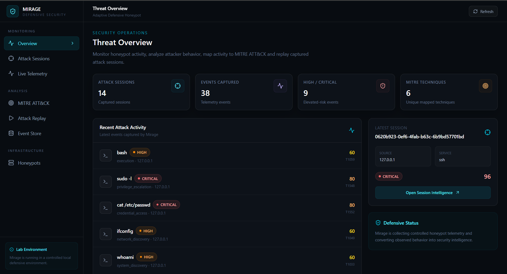
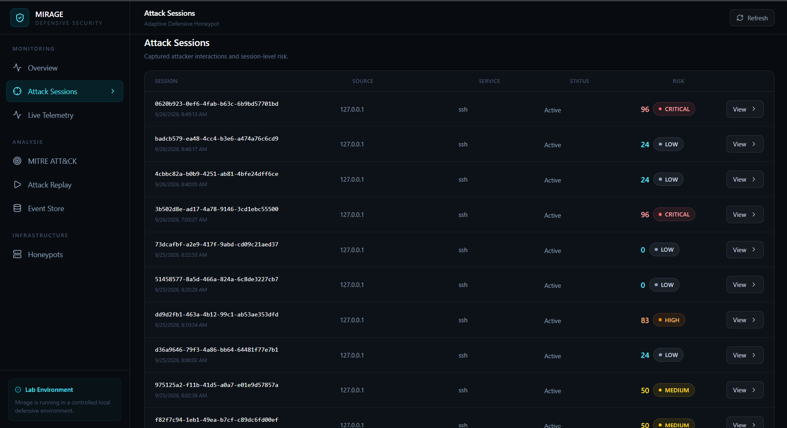
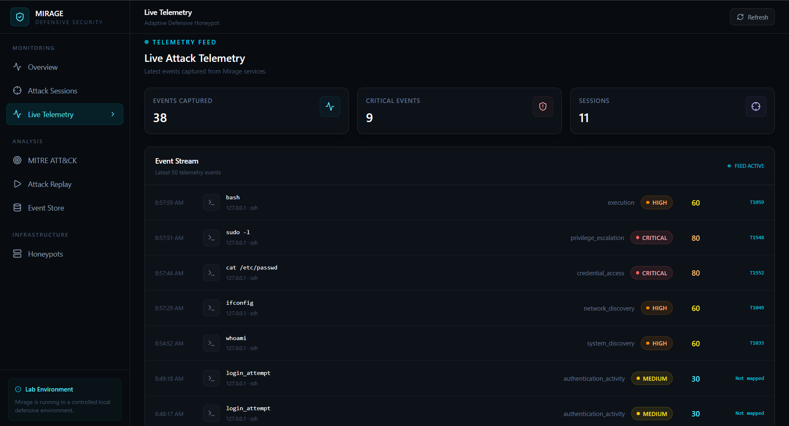
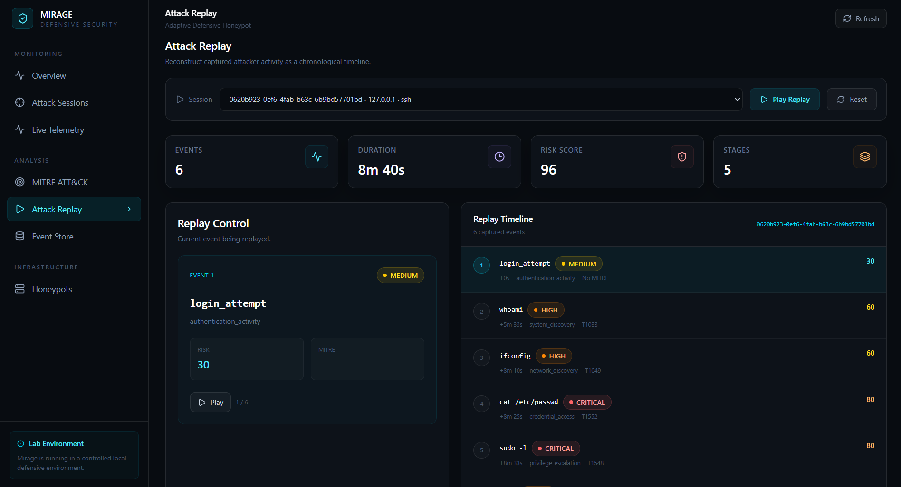

# 🛡️ Mirage — Adaptive Defensive Honeypot

**A controlled defensive honeypot for security research, attack behavior analysis, session intelligence, and MITRE ATT&CK mapping.**

Mirage is a cybersecurity research project designed to simulate a controlled server environment and observe suspicious interaction patterns in an isolated lab.

It captures attacker-like activity, analyzes commands and behaviors, maps observed techniques to MITRE ATT&CK, calculates session risk, tracks attack progression, and provides an interactive security dashboard.

---

## ✨ Features

* 🍯 Controlled TCP-based honeypot
* 🧠 Behavioral command analysis
* 🎯 MITRE ATT&CK technique mapping
* 📊 Session risk scoring
* 🚨 Severity classification
* 🧭 Attack progression tracking
* ⏱️ Attack session replay
* 📡 Real-time telemetry
* 🖥️ React security dashboard
* 💾 Persistent event and session storage

---

## 🧠 Behavior Analysis

Mirage analyzes observed commands and categorizes them into security-relevant behaviors.

| Behavior                | Example           | Risk |
| ----------------------- | ----------------- | ---: |
| Authentication Activity | Login attempt     |   30 |
| System Discovery        | `whoami`          |   60 |
| Network Discovery       | `ifconfig`        |   60 |
| File Discovery          | `ls`              |   50 |
| Credential Access       | `cat /etc/passwd` |   80 |
| Privilege Escalation    | `sudo -l`         |   80 |
| Execution               | `bash`            |   60 |
| Command Execution       | Unknown commands  |   40 |

Risk values are part of the current Mirage detection model and are not intended to represent a universal threat score.

---

## 🎯 MITRE ATT&CK Mapping

Mirage maps detected behaviors to relevant MITRE ATT&CK techniques.

| Behavior             | Technique | Tactic               |
| -------------------- | --------- | -------------------- |
| System Discovery     | T1033     | Discovery            |
| Network Discovery    | T1049     | Discovery            |
| File Discovery       | T1083     | Discovery            |
| Credential Access    | T1552     | Credential Access    |
| Privilege Escalation | T1548     | Privilege Escalation |
| Command Execution    | T1059     | Execution            |

---

## 📊 Session Intelligence

Mirage calculates a session-level risk score using:

* Highest observed event risk
* Average event risk
* Behavioral diversity
* High-risk activity
* Critical activity

Example:

```text
Session Risk    : 96
Threat Level    : CRITICAL
Events          : 6
Attack Stages   : 5
MITRE Techniques: 5
```

---

## 🧭 Attack Progression

Observed activity can be represented as a progression:

```text
Initial Access
      ↓
Discovery
      ↓
Credential Access
      ↓
Privilege Escalation
      ↓
Execution
```

This provides an analyst-friendly view of how activity developed during a session.

---

## ⏱️ Attack Replay

Mirage can reconstruct a session as a chronological timeline containing:

* Event sequence
* Timestamp
* Relative time
* Username
* Command
* Behavior category
* Risk score
* Severity
* MITRE technique
* MITRE tactic
* Event description

---

## 🖥️ Security Dashboard

The React dashboard provides dedicated views for:

* Overview
* Attack Sessions
* Session Intelligence
* Live Telemetry
* MITRE ATT&CK
* Attack Replay
* Honeypots
* Event Store

---

## 🏗️ Architecture

```text
                    ┌─────────────────────┐
                    │   Lab Interaction  │
                    └──────────┬──────────┘
                               │
                               ▼
                    ┌─────────────────────┐
                    │  Mirage Honeypot   │
                    │    TCP :2222       │
                    └──────────┬──────────┘
                               │
                               ▼
                    ┌─────────────────────┐
                    │     Telemetry      │
                    └──────────┬──────────┘
                               │
              ┌────────────────┼────────────────┐
              ▼                ▼                ▼
        ┌───────────┐    ┌───────────┐    ┌───────────┐
        │ Behavior  │    │   MITRE   │    │    Risk   │
        │  Engine   │    │  Mapper   │    │   Engine  │
        └─────┬─────┘    └─────┬─────┘    └─────┬─────┘
              │                │                │
              └────────────────┼────────────────┘
                               ▼
                    ┌─────────────────────┐
                    │ Session Intelligence│
                    │  & Attack Replay    │
                    └──────────┬──────────┘
                               │
                               ▼
                    ┌─────────────────────┐
                    │    FastAPI API      │
                    │       :8000         │
                    └──────────┬──────────┘
                               │
                               ▼
                    ┌─────────────────────┐
                    │   React Dashboard   │
                    │       :5173         │
                    └─────────────────────┘
```

---

## 🛠️ Tech Stack

**Backend**

* Python
* FastAPI
* Uvicorn
* SQLAlchemy
* SQLite
* AsyncIO

**Frontend**

* React
* Vite
* JavaScript
* Lucide React

**Security**

* Behavioral analysis
* Risk scoring
* MITRE ATT&CK mapping
* Attack progression
* Session intelligence
* Attack replay

---

## 📁 Project Structure

```text
Mirage/
├── backend/
│   └── app/
│       ├── attack/
│       ├── behavior/
│       ├── honeypot/
│       ├── telemetry/
│       └── main.py
│
├── dashboard/
│   └── src/
│       ├── App.jsx
│       ├── api.js
│       └── ...
│
├── .gitignore
└── README.md
```

---

## 🚀 Local Setup

### Clone

```bash
git clone https://github.com/parvamodi2006-art/Mirage.git
cd Mirage
```

### Backend

```cmd
python -m venv .venv
.venv\Scripts\activate
pip install -r requirements.txt
uvicorn backend.app.main:app --reload --port 8000
```

Backend:

`http://127.0.0.1:8000`

API documentation:

`http://127.0.0.1:8000/docs`

### Dashboard

Open another terminal:

```cmd
cd dashboard
npm install
npm run dev
```

Dashboard:

`http://localhost:5173`

---

## 🍯 Honeypot

The current Mirage honeypot listens on:

```text
127.0.0.1:2222
```

The current implementation is a controlled plain TCP line-based honeypot and does not implement the real SSH protocol.

---

## 📡 API

### Health

```text
GET /
GET /health
```

### Sessions

```text
POST /api/telemetry/session
GET  /api/telemetry/sessions
GET  /api/telemetry/sessions/{session_id}
GET  /api/telemetry/sessions/{session_id}/replay
```

### Events

```text
POST /api/telemetry/event
GET  /api/telemetry/events
```

---

## 🔐 Security Considerations

Mirage is intended for controlled security research and authorized laboratory environments.

When experimenting with a honeypot:

* Use an isolated VM or container.
* Never expose real credentials.
* Never connect simulated services to production systems.
* Do not provide access to the real host filesystem.
* Monitor only systems and traffic you are authorized to test.

The current implementation should be treated as a research/lab honeypot rather than a production internet-facing deception platform.

---

## 🗺️ Roadmap

### Completed

* [x] Honeypot listener
* [x] Session tracking
* [x] Event telemetry
* [x] Behavioral analysis
* [x] Risk scoring
* [x] MITRE ATT&CK mapping
* [x] Attack progression
* [x] Attack replay
* [x] React dashboard

### Planned

* [ ] Adaptive deception
* [ ] HTTP honeypot
* [ ] Multi-session correlation
* [ ] Fake credentials and files
* [ ] Threat intelligence enrichment
* [ ] Automated security reports
* [ ] Attacker fingerprinting
* [ ] Containerized deployment
* [ ] Public demonstration environment

---

## 👨‍💻 Author

**Parva Modi**

Cybersecurity Student / Trainee

Focus areas:

* Penetration Testing
* VAPT
* SOC Operations
* Threat Detection
* Security Engineering

---

## ⚠️ Disclaimer

Mirage is intended for authorized security research, education, and controlled laboratory environments only.

Do not deploy or use the project against systems or networks without proper authorization.

---

⭐ If you find Mirage useful, consider giving the repository a star.

## 📸 Dashboard Preview

### Overview



### Session Intelligence



### Live Telemetry



### Attack Replay

